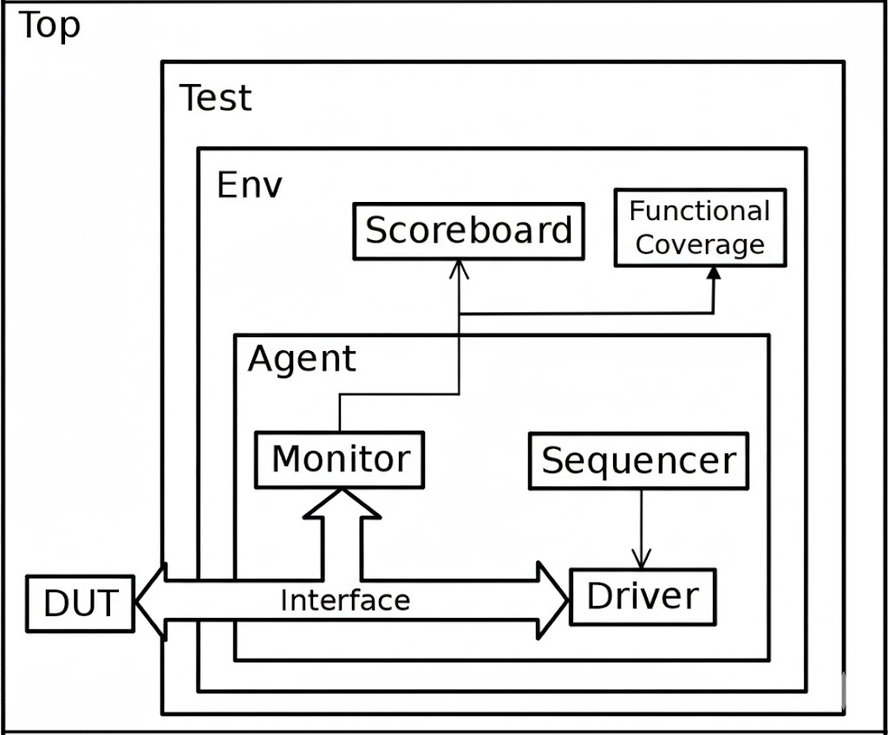
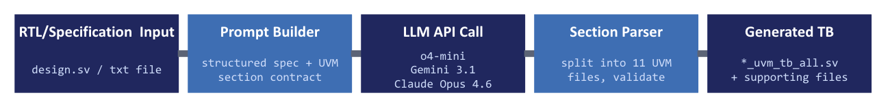
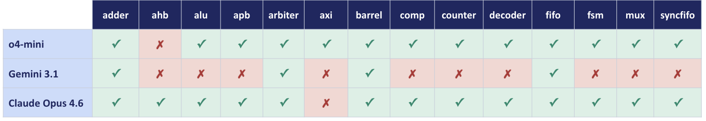
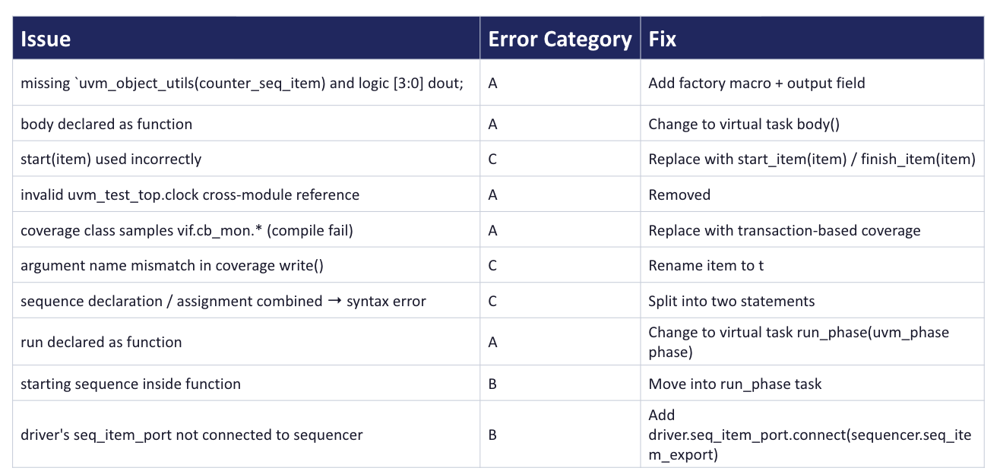
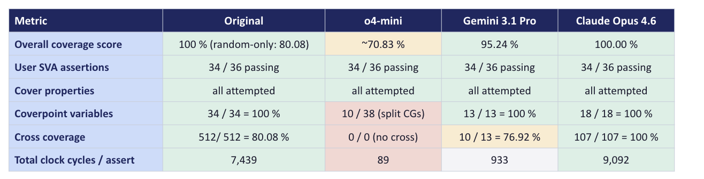
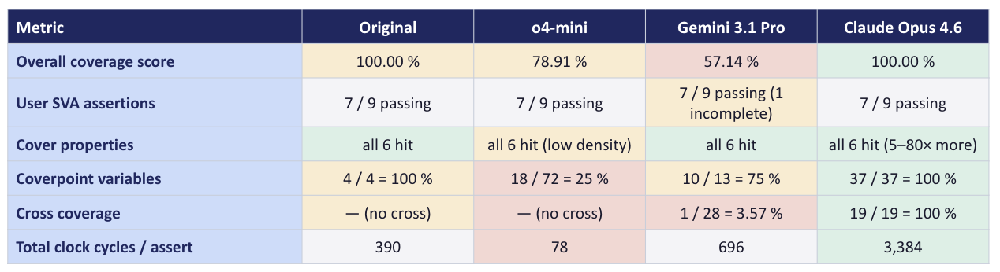
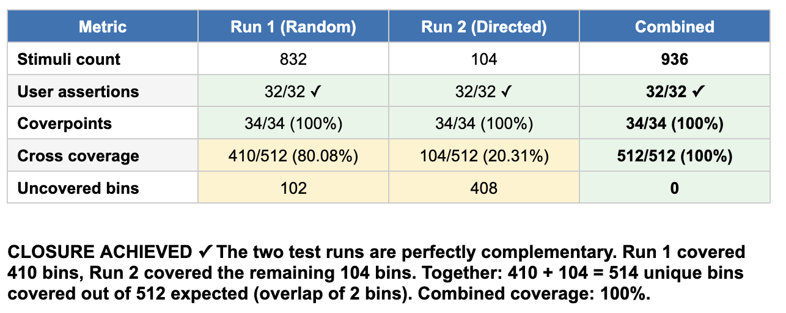

# Using LLMs for UVM Testbench Generation

> **NYU Tandon · ECE 9953 (Spring 2026) · Independent Project**
> **Student:** Archie Gupta (`ag10276`) **·** **Advisor:** Dr. Ramesh Karri

[](#)
[](#)
[](#)

---

## Project Intent

Functional verification dominates modern ASIC/SoC development cost — an estimated **60–70% of total project effort**. Within that budget, the **Universal Verification Methodology (UVM)** (IEEE 1800.2) is the dominant industrial framework. A single UVM testbench comprises roughly eleven coordinated components — sequence item, sequence, sequencer, driver, monitor, agent, scoreboard, coverage subscriber, environment, test, and a top-level harness — most of which is structural boilerplate repeated across every DUT.

<p align="center">
  
  <br/>
  <em>Figure 1 — Standard UVM testbench architecture: Top → Test → Env → Agent → Driver/Monitor/Sequencer.</em>
</p>

This pattern-driven nature makes UVM a natural target for Large Language Models. While prior work has shown LLMs can produce non-trivial RTL and assertion-style properties, the narrower question of whether they can produce **production-quality UVM testbenches** remains open. Producing eleven files with the right macros is the easy part; producing a testbench that compiles, simulates, hits all coverage bins, and faithfully checks the design is much harder.

This project asks: **Can LLMs act as verification co-pilots — accelerating UVM testbench creation while preserving correctness, coverage, and methodology compliance?**

The work consists of three parts:

1. **A golden reference database** — fourteen hand-written UVM testbenches covering combinational designs, sequential designs, and bus-protocol slaves, each with bound SVA modules.
2. **An automated generation script** ([`LLM_Gen_UVM_TestBench.py`](LLM_Gen_UVM_TestBench.py)) that turns RTL or text specifications into complete UVM testbenches using one of three LLMs.
3. **A four-axis benchmark** comparing LLM-generated testbenches against the golden reference on structural conformance, compile/runtime success, functional coverage, and assertion coverage.

---

## Repository Layout

```
UVM_Testbenches/
├── LLM_Gen_UVM_TestBench.py        ← The generation script
├── Reference_Testbenchs/           ← Hand-written golden testbenches (14 designs)
│   ├── UVM_TB_Adder/               (design.sv + testbench.sv per design)
│   ├── UVM_TB_ALU/
│   ├── UVM_TB_AHB/
│   ├── UVM_TB_APB/
│   ├── UVM_TB_AXI/
│   ├── UVM_TB_Arbiter/
│   ├── UVM_TB_Barrel_Shifter/
│   ├── UVM_TB_Comparator/
│   ├── UVM_TB_Counter/
│   ├── UVM_TB_Decoder/
│   ├── UVM_TB_FSM/
│   ├── UVM_TB_Mux/
│   ├── UVM_TB_Sync_FIFO/
│   └── UVM_TB_USR/
├── LLM_Generated_Testbenches/      ← One single-file TB per (design × model)
│   └── <design>/{claude,gem31,mini}_<design>_uvm_tb_all.sv
├── Coverage_Reports/               ← VCS URG output for every TB
│   └── <design>/{claude,gem31,mini,org}_{asserts,grpinfo}.txt
└── Documents/
    ├── ag10276_Project_Proposal.pdf
    ├── ag10276_FinalReport.pdf
    ├── ag10276_FinalPresentation.pptx
    └── figures/                    ← Figures referenced in this README
```

> **Note:** the folder is `Reference_Testbenchs` (the spelling matches what's on disk).

**Naming convention** — each LLM has a short tag used throughout the repo:

| Tag | Model |
|---|---|
| `claude` | Claude Opus 4.6 |
| `gem31` | Gemini Pro 3.1 Preview |
| `mini` | OpenAI o4-mini |
| `org` | Original / golden hand-written reference |

The fourteen designs span three difficulty tiers:

- **Combinational** — 4:1 mux, 3-to-8 one-hot decoder, 2-bit comparator, 4-bit ripple-carry adder, 8-bit ALU (8 opcodes), 8-bit right barrel shifter.
- **Sequential** — 4-bit up/down counter, 8-bit universal shift register (USR), four-state traffic-light FSM, round-robin arbiter, 8-entry synchronous FIFO.
- **Bus-protocol slaves** — APB3 memory slave, AHB-Lite memory slave, AXI4 memory slave.

---

## How to Use the Script

The generator ([`LLM_Gen_UVM_TestBench.py`](LLM_Gen_UVM_TestBench.py)) accepts either RTL files (`.v` / `.sv`) or natural-language specifications (`.txt`) and produces all eleven UVM components plus a combined single-file version, an analysis readme, and a compile order. It supports two API backends and three LLM providers, with multithreaded batch processing, retry-with-backoff, and skip-if-done idempotency.

<p align="center">
  
  <br/>
  <em>Figure 2 — Framework for LLM-assisted testbench generation.</em>
</p>

### Setup

```bash
pip install portkey-ai openai anthropic google-genai tqdm
```

Set the API key for whichever backend you intend to use:

```bash
# NYU Portkey gateway (default)
export PORTKEY_API_KEY="your-portkey-key"

# OR direct provider keys (--backend direct)
export OPENAI_API_KEY="sk-..."        # for o4-mini and other GPT models
export CLAUDE_API_KEY="sk-ant-..."    # for Claude Opus 4.6
export GEMINI_API_KEY="..."           # for Gemini Pro 3.1
```

### Quick Examples

```bash
# Single RTL design with Claude via Portkey gateway
python LLM_Gen_UVM_TestBench.py \
    --model @vertexai/anthropic.claude-sonnet-4-6 \
    --design Reference_Testbenchs/UVM_TB_Adder/design.sv

# Single design via direct OpenAI API
python LLM_Gen_UVM_TestBench.py --backend direct \
    --model gpt-4o --design alu.v

# Batch process a folder, 3 attempts each, 8 threads
python LLM_Gen_UVM_TestBench.py \
    --model @gpt-4o/gpt-4o \
    --input-dir ./rtl --attempts 3 --threads 8

# Spec-driven generation (.txt input — LLM also generates the interface + SVA)
python LLM_Gen_UVM_TestBench.py \
    --model @vertexai/anthropic.claude-sonnet-4-6 \
    --design ./specs/uart_spec.txt \
    --max-tokens 32768
```

### CLI Reference

| Flag | Default | Purpose |
|---|---|---|
| `--model` | *required* | Model name (Portkey `@provider/model` or bare for direct) |
| `--backend` | `portkey` | `portkey` (NYU gateway) or `direct` (OpenAI/Anthropic/Google) |
| `--provider` | auto-detect | `ChatGPT` / `Claude` / `Gemini` (direct mode only) |
| `--model-choice` | inherits `--model` | Specific model version (direct mode only) |
| `--design` | — | Single input file (`.v` / `.sv` / `.txt`) |
| `--input-dir` | `./rtl` | Directory for batch mode (mixes RTL and spec files) |
| `--output-dir` | `./uvm_output` | Where generated testbenches are written |
| `--attempts` | `1` | Number of independent versions per design (saved as `v1/`, `v2/`, …) |
| `--threads` | `4` | Parallel worker count |
| `--max-tokens` | `16384` | Max LLM output tokens |

Output is organised as:

```
<output-dir>/<model>/<design_basename>/v<version>/
    <base>_seq_item.sv,  <base>_seq.sv,  <base>_sequencer.sv,
    <base>_driver.sv,    <base>_monitor.sv,  <base>_scoreboard.sv,
    <base>_coverage.sv,  <base>_agent.sv,    <base>_env.sv,
    <base>_test.sv,      tb_top.sv
    <base>_uvm_tb_all.sv         ← combined single-file version
    <base>_if.sv                 ← only in spec mode
    ANALYSIS.md, compile_order.txt
```

---

## Methodology

### Generation Pipeline

A Python driver loads each RTL/spec file, builds a structured prompt that lists the eleven required UVM sections and embeds the DUT module, calls the chosen model through a unified API gateway, and parses the response into the eleven UVM files plus a top-level harness, Makefile, and filelist. Each `(model, design)` pair was attempted once; failing pairs were retried up to three additional times with the same prompt to bound retry-recovery rates.

### Evaluation Setup

Every testbench — both LLM-generated and golden — was compiled and simulated under **Synopsys VCS** with identical compile flags and the same bound SVA module. Four orthogonal axes were measured:

1. **Structural conformance** — were all eleven required UVM sections produced?
2. **Compile and runtime success** — every manual edit needed to reach clean elaboration and a non-hanging simulation, tagged with one of 30 issue classes grouped into three buckets (prompt-fixable, architectural, model-inherent).
3. **Functional coverage** — variable-bin closure, cross-bin closure, and total covered bins from the URG report.
4. **Assertion coverage** — per-property attempts, matches, and pass/fail status.

For each design, the testbench was also classified by which one wins on three sub-axes: **best by raw score**, **best from a testing point of view** (depth of model and discipline), and **best on assertion coverage** (stimulus density and pass rate).

---

## Summary of Results

### Structural Conformance (First Attempt)

| Model | Pass rate | Designs passed | Primary failure mode |
|---|---|---|---|
| **Claude Opus 4.6** | **93%** | 13 / 14 | AXI only (output token budget) |
| **OpenAI o4-mini** | **93%** | 13 / 14 | AHB only (incidental compile error) |
| Gemini Pro 3.1 | 29% | 4 / 14 | Heavy output truncation |

<p align="center">
  
  <br/>
  <em>Figure 3 — Per-design first-pass structural conformance for each model. Gemini 3.1's failures are dominated by output truncation on the long protocol-design TBs.</em>
</p>

Gemini 3.1's failures resolve by raising the token budget from 16k to 63k. Retries recovered structural conformance for every failure on at least one of three attempts, indicating the underlying capability is present but **determinism is the gap**.

### Compile and Runtime Success

**Zero of three models produced a testbench that compiled and ran cleanly under VCS without manual intervention.** Every output required at least one human edit; some required dozens. The 30 distinct issue classes group into three buckets:

| Bucket | Count | Primary cause | Prompt-fix yield |
|---|---|---|---|
| **A — Prompt-Fixable** | 15 classes | Boilerplate forgetfulness, recurring scaffolding mistakes (missing `` `uvm_macros.svh ``, missing factory-registration macros, non-virtual interfaces, `run_phase` declared as function instead of task, coverpoints sampling the virtual interface instead of the transaction) | **High** — prompt templates and a do/don't reference card close most of this |
| **B — Architectural** | 6 classes | UVM phase / connection model not fully internalised (components built in the wrong phase, missing `connect_phase` wiring, forgotten objections causing PH_TIMEOUT or hangs) | Medium — a worked-out skeleton testbench in the prompt |
| **C — Model-Inherent** | 9 classes | Hallucinated UVM APIs (`sequencer.start()`, `driver.start()`), missing transaction output fields, wrong scoreboard reference models that compile cleanly but flag every transaction with `[SCB_FAIL]` | Low — needs better models, retrieval grounding, or post-hoc validation |

<p align="center">
  
  <br/>
  <em>Figure 4 — Counter TB generated by Claude: representative compile errors and their bucket classification (A / B / C).</em>
</p>

Gemini 3.1 was the model most prone to wrong-reference-model bugs, which are the hardest to catch because the testbench looks right and runs cleanly while checking the wrong thing.

### Functional & Assertion Coverage — Aggregate

Averaged across all 14 designs (parsed directly from `Coverage_Reports/`):

| Source | Assertion success rate | Variable bin closure | Cross-bin closure |
|---|---|---|---|
| **Claude Opus 4.6** | **85.1%** | **96.5%** | **73.3%** |
| Gemini Pro 3.1 | 81.6% | 89.2% | 55.6% |
| Original (golden) | 80.2% | 95.7% | 69.0% |
| OpenAI o4-mini | 75.6% | 70.8% | 51.5% |

Claude leads on average, but the average masks a sharper pattern: Claude wins decisively on simple/sequential designs while the golden hand-written TB retains a lead on bus-protocol designs.

<p align="center">
  
  <br/>
  <em>Figure 5 — Adder: original vs LLM testbenches on functional coverage and assertions. Claude shows 100% coverage but with fewer coverpoint variables and crosses than the original; o4-mini lags significantly on coverpoint variable closure.</em>
</p>

<p align="center">
  
  <br/>
  <em>Figure 6 — Universal Shift Register: a different outcome — Claude exceeds the original on both number of coverpoint variables and cross coverage, while o4-mini defines no cross coverage at all.</em>
</p>

### Per-Design Verdict

From the report's Table 4, classified by which testbench wins each sub-axis:

| Design | Best by score | Best from a testing PoV | Best assertion coverage |
|---|---|---|---|
| Mux | tied (orig / o4-mini / claude) | Claude | Claude |
| Decoder | Original | Claude | Claude (close to Original) |
| Comparator | Original | Claude | Original (24K attempts) |
| Adder | Claude (organic) | Claude | Claude |
| ALU | Original (hollow) | Claude | Claude |
| Barrel shifter | Original (hollow) | Claude | Claude |
| Counter | tied (o4-mini / claude) | Gemini 3.1 (transition bins) | Claude |
| USR | tied (orig / claude) | Claude | Claude |
| FSM | Original | Claude (full-cycle seq.) | Claude |
| Sync FIFO | tied (orig / gem31) | Claude | Original (corner stimulus) |
| APB | tied (orig / gem31) | Claude | Original (FSM transitions) |
| Arbiter | Original (3 runs) | **Original** | **Original** (caught 10 fails) |
| AHB | Gemini 3.1 | **Original** | Claude |
| AXI | **Original** | **Original** | **Original** |

**Pattern:** Claude dominates the testing-PoV sub-axis on every non-protocol design through richer covergroup models, output observability, `ignore_bins` discipline, transition coverpoints, and user-defined cross-bins formalising protocol invariants — combined with the highest stimulus density on most designs. The original wins the four protocol designs (APB, AHB, AXI, arbiter) where it is the only TB to use protocol-specific `ignore_bins`, `HBURST` coverage, FSM-traversal stimulus tuning, and back-to-back transition crosses. o4-mini is competitive on simple designs but collapses on protocol designs (APB at 40.62%, arbiter at 21.74%) with stimulus density 10–100× below Claude on every design.

### LLM-Driven Coverage Closure

The script was also used as a **closure engine** — feeding the URG report back to the LLM to generate directed sequences targeting uncovered bins.

<p align="center">
  
  <br/>
  <em>Figure 7 — Adder: complementary random + directed runs achieve 100% closure. The LLM-generated directed run targeted the 102 cross-coverage bins missed by the random run.</em>
</p>

Selected outcomes:

| Design | Pass 1 score | Final score | LLM passes added | Closure mechanism |
|---|---|---|---|---|
| Mux | 65.28% | **100.00%** | 1 | Constraint widening on input data values |
| Adder | 80.08% | **100.00%** | 1 | Directed sequence targeting 102 uncovered (a, b, cin) bins |
| Counter | — | **100%** | 1 | Coverage subscriber missing in original; LLM added covergroup spec |
| USR | 83.33% | **100.00%** | 1 | Directed load-then-hold sequence to fire `COVER_LOAD_THEN_HOLD` |
| Arbiter | <100% | **100.00%** | 1 | LLM added `illegal_bins` for impossible req/grant pairs (60 → 32 legal cross) |
| AHB-Lite | 70.56% | 70.56% | 1 | LLM added INCR4 burst sequence; IDLE/BUSY HTRANS still uncovered |
| AXI4 | 65.52% | 65.52% | 1 | LLM authored back-pressure pass; 8 stability bins unreachable (DUT architecture) |

The LLM closes coverage well when uncovered bins are reachable through small, well-described modifications to the constraint solver (widening a value range, adding a `randc` cycling order, specifying a directed tuple list), and it occasionally proposes modelling improvements the human author had missed. It struggles when closure requires architectural changes to the DUT or deep protocol understanding.

---

## Headline Findings

1. **Structural conformance is largely solved.** Claude Opus 4.6 and o4-mini both produce all eleven correctly-named UVM sections on 13 of 14 designs in a single attempt. Retry recovery closes most remaining structural failures.

2. **Structural correctness is necessary but not sufficient.** Zero of three models produced a testbench that elaborated and simulated cleanly without manual intervention. The bulk of compile failures (15 of 30 issue classes) sit in a prompt-fixable bucket of recurring scaffolding mistakes.

3. **The verification-quality gap is sharper than the structural one.** Claude produces the structurally richest covergroups on most designs, but on the four bus-protocol designs — and on the only design that exposed a real bug — the hand-written original retains a meaningful lead through protocol-aware `ignore_bins` discipline and corner-case stimulus tuning.

> **LLMs are credible UVM first-draft authors today; they are not yet competent verification engineers.**

---

## Future Work

1. **Skeleton-based prompt engineering.** Provide a worked-out UVM testbench skeleton in the prompt with all eleven sections stubbed and TLM hookups pre-wired. Should close most of the prompt-fixable Bucket A without any change to the model, and is directly measurable against the structural-conformance table above.

2. **Coverage-driven feedback loops.** Parse URG output programmatically, hand the structured summary to the LLM, and accept proposed sequences only if they (a) compile, (b) close at least one previously uncovered bin, and (c) do not regress any existing bin. This automates the iterative closure process the script already supports manually.

3. **Integration with LLM-generated assertions.** Let the LLM propose the bound SVAs alongside the testbench. The present study deliberately controls for this by using a fixed assertion set; lifting that control requires a separate reference-oracle infrastructure to evaluate honestly.

4. **Localised training on industry UVM testbenches.** Fine-tune or otherwise pre-condition the model on real-world UVM corpora to attack the failures that prompting alone cannot close — particularly the Bucket C residue around hallucinated APIs and wrong scoreboard reference models.

---

## Documents

Full project deliverables in [`Documents/`](Documents/):

- 📄 [**`ag10276_Project_Proposal.pdf`**](Documents/ag10276_Project_Proposal.pdf) — original project proposal and timeline
- 📄 [**`ag10276_FinalReport.pdf`**](Documents/ag10276_FinalReport.pdf) — full 8-page final report with all tables and figures
- 📊 [**`ag10276_FinalPresentation.pptx`**](Documents/ag10276_FinalPresentation.pptx) — final presentation slides

---

## Acknowledgements

Independent research project under **Dr. Ramesh Karri** (NYU Tandon) — Spring 2026, ECE 9953. Compute and API access provided through the NYU Portkey AI Gateway.

Feedback and design suggestions are warmly welcomed.
